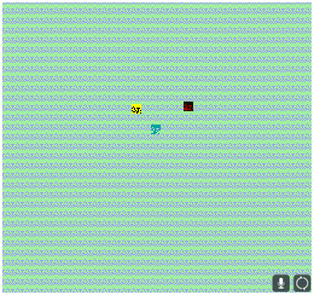

# PitNotQoQGWAiaELttRtD - PPPPP is the name of the quote on quote game, whose acronym is an exercise left to the reader to decipher

Author: Pablo Wilson

Design: This was supposed to be a game where you were a rover who was left only with the instructions "protect the package". Your means of protecting said package from the
endless onslaught of asteroids is your very slow firing laser or picking up and slowly moving the package, but you only have enough power to do one at a time.

What this ended up becoming due to events in the past week was one where you are a rover who moves a package from one place to the goal endlessly. Overall I am not happy with
how it turned out

Screen Shot:

How Your Asset Pipeline Works:

It takes a png source file, then uses the load_save_png.hpp library to convert to png into an array of vec4s. I then (incorrectly) iterate over them so that I sample at 64
points to create the 8x8 tile, which is then uploaded to the PPU446. While this does technically "work" it doesn't accurately portray the source image as I would have liked.

How To Play:

Arrow keys to move, press and hold space to carry the package, release to drop it at the red goal

Sources: All sprites sourced from Kenney.nl: https://kenney.nl/assets/space-shooter-extension

This game was built with [NEST](NEST.md).

